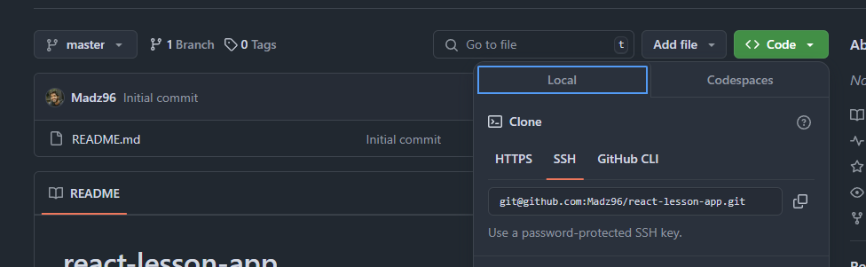
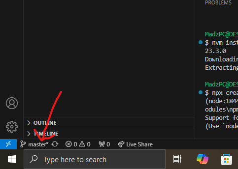

# react-lesson-app

## Getting Started

### Setting up Node

1. Install "Node Version Manager" (nvm). This tool allows you to install and manage multiple Node versions in your device.
2. Once installed, test whether it's working by running the command "nvm" in a command terminal.
3. Once verified, run "nvm install 23.3.0" to install the version of Node this project was created.
4. Once the installation is completed, run "nvm use 23.3.0" to use the installed Node version (will be prompted once the installation is completed)

### Setting up the project
1. Clone the project into your computer.
    - Get the repository link (HTTPS (will prompt for email and password when cloning in terminal) / SSH (you need to setup the ssh key for your account)).

    

    - use `git clone <link>` to copy the repository

2. Once cloned, run `npm install` to add the needed dependencies before running the project

3. Use `git checkout -b <branch_name>` before starting work.
    - `git checkout -b <branch_name>` is the equivalent of running `git branch <branch_name>` and then `git checkout <branch_name>`. The command will create the new branch and check you out the new branch on the same go.
    - You can verify your current working branch here in your IDE (VSCode)

    

4. Run `npm start` and continue working on your assigned tasks.

Happy Hacking!